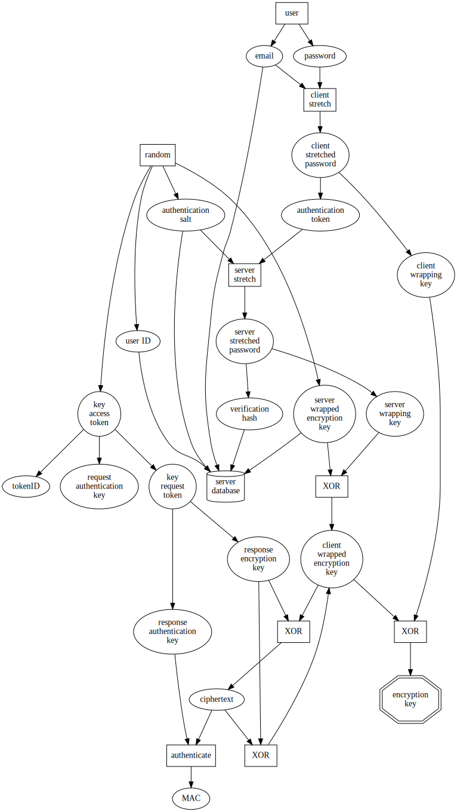

e-mail-authenticated keyserver protocol inspired by [Mozilla's onepw](https://github.com/mozilla/fxa-auth-server/wiki/onepw-protocol)

A few differences:

- fully parameterized primitives
- single encryption key
- independent derivation of each subkey

See [`test.js`](./test.js) for an example of use with [sodium-native](https://www.npmjs.com/package/sodium-native) primitives.

